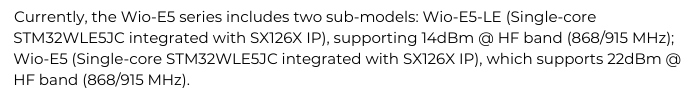
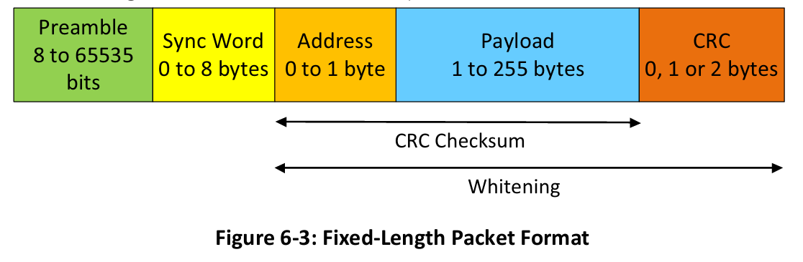
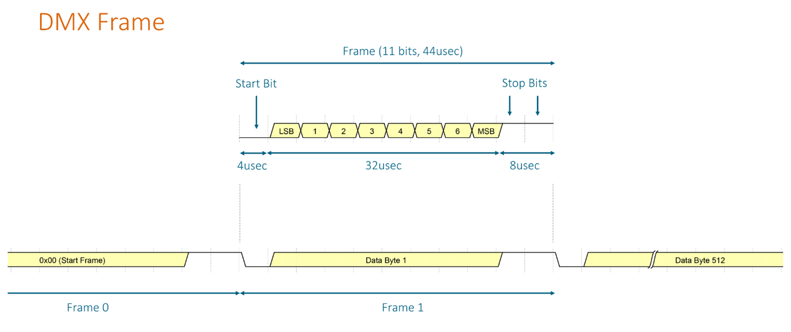

# WSF Wireless Spotlight Focus
## System design
### Transmitter
* STM32WLE5JC
* ISO1410BDW ?
* SCT01F03S3V3 ?
* seven-segment display
* buttons

### Receiver
* STM32WLE5JC
* DRV8434A - driver for bipolar motor with stall detection TI
* 17HS2408 - nema bipolar motor 
* 4 bit DIP switch

### Devel
* NUCLEO-WL55JC1 14dBm @150-960 MHz (STM32WLE5JCI7)

## System parts

### Wio-E5-HF
All variants based on STM32WLE5JC: 
* Wio-E5
    * Hight power variant TX +22dBm 
* Wio-E5-LE
    * Low energy variant TX +14dBm (same PA as NUCLEO-WL55JC1 board)
* Wio-E5-HF/LF
    * HF band (868/915 MHz)
    * LF band (868/915 MHz)
 

All using SX126x which is the one in STM32WL (the closest is the SX1262).  
SX1278 was used in Ai-thinker modules Ra-02, as older version @433MHz

## Radio link design

### Legal options
<ol type="A">
  <li>433,05–434,79 MHz @ 10 mW e.r.p., 10 % DC</li>
  <li>434,04–434,79 MHz @ 10 mW e.r.p., až 100 % DC pri BW ≤ 25 kHz</li>
  <li><b>869,40–869,65 MHz @ 500 mW e.r.p., LBT/AFA alebo DC ≤ 10 %</b></li>
</ol>
(LBT/AFA - polite access - listening to the channel before transmitting)

### Modulation options
**FSK/BFSK** - Frequency-shift keying (Binary)  
**MSK** - Minimum-shift keying ($\beta=0.5$), minimum means that the subcarriers are orthogonal - sinc in zero points  
**GMSK** - Gaussian MSK, using gaussian filter before modulation to improve spectral efficiency

### Link design
Frame structure:  
(preamble 0x55 55 55 55 55, sync, number of fixtures with 0-255 value, CRC, packet frequency, duty cycle)
$$R_{b, min}=(5*8+3*8+16*8+2*8)*20*10=208*20*10=\\4.16*10=41.6~\text{kbit/s}$$
Therefore shooing bitrate  **50 kbit/s**.

### Radio design
$$\beta=\frac{2*F_D}{R_B}$$
$$BW=2(R_B+F_D)$$
|Property | Value  |
|---|---|
|Carrier frequency| $F_c=869.5~\text{MHz}$ |
|Chosen bitrate| $F_B=50~\text{kbit/s}$ |
|Modulation index| $\beta=1$ |
|Frequency deviation| $F_D=\frac{\beta * R_B}{2}=25~\text{kHz}$ |
|  Bandwidth | $BW=2(R_B+F_D)=150~\text{kHz}$  |
|  TimeOverAir  | 10% |
|  Power  | $P=10-22~\text{dBm}$ |
|  Preamble length  | $5*8$ bit (default, `0x55`) |
|  Synch word  | 3 bytes `0xC1, 0x94, 0xC1`|
|  CRC  | 2 byte CRC-16-CCITT |
|  Whitening  | 9-bit LFSR `x9 + x5 + 1` |
|  GFSK shape  | 1 (?) |

 

## FW design
### DMX
* 250kbit/s
* start of packet + 513frames
* frame frequency = 12.5Hz ish (70-90ms)
* 1 frame = start bit + 8bit + 2 stop bit

 

